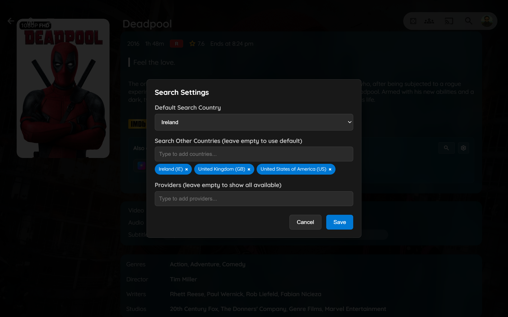
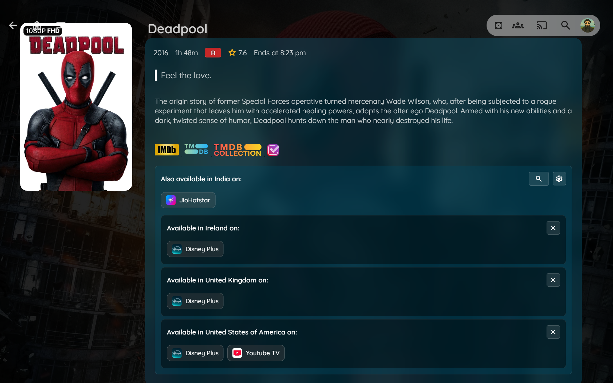

# Jellyfin Elsewhere


A script that seamlessly integrates with your Jellyfin interface to show you where else your movies and TV shows are available to stream. Using the TMDB API, it provides up-to-date streaming provider information directly on the item details page.

-------------


| Search Settings | Search Other Regions |
|-----------------|----------------------|
| |  |


## Prerequisites

 **TMDB API Key**
1. Visit [The Movie Database (TMDB)](https://www.themoviedb.org/)
2. Create a free account or sign in
3. Go to your [API settings](https://www.themoviedb.org/settings/api)
4. Request an API key (choose "Developer" option)

## 🔧 Installation

You can install the script in one of below ways:

<p align="center">
----
</p>

### **Method 1: Modify Web Root**

1. **Locate your Jellyfin web root directory:**
   ```bash
   # Common paths:
   # Ubuntu/Debian: /usr/share/jellyfin/web/
   # Docker: /jellyfin/jellyfin-web/
   # Windows: C:\Program Files\Jellyfin\Server\jellyfin-web\
   ```

2. **Edit the index.html file:**
   ```bash
   sudo nano /usr/share/jellyfin/web/index.html
   ```

3. **Add the script reference before the closing `</head>` tag:**
   ```html
   <script defer src="jf_elsewhere.js"></script>
   ```

4. **Download the script:**
   ```bash
   curl -o /usr/share/jellyfin/web/jf_elsewhere.js https://raw.githubusercontent.com/n00bcodr/jellyfin-elsewhere/main/jf_elsewhere.js
   ```
   > [!Warning]
   > Upgrading Jellyfin will wipe out all the modifications


5. Update your API Key and other [configuration options](#config)

6. **Clear browser cache and reload Jellyfin**

> [!TIP]
> Check your Jellyfin server logs to find the exact web directory path for your installation.

<p align="center">
----
</p>

### **Method 2: Plugin (Server-Wide)**

1.  Install the [Jellyfin JavaScript Injector Plugin](https://github.com/n00bcodr/Jellyfin-JavaScript-Injector) and reboot your Jellyfin server.
2.  Navigate to **Dashboard -> Plugins -> JavaScript Injector**.
3.  Click on "Add Script"
4.  Paste the contents of `jf_elsewhere.js` into the script area.
5.  Save and Refresh.

> [!NOTE]
> **Clear your cache** if you do not see changes reflect.

<p align="center">
----
</p>

### **Method 3: Browser Extension (User-Specific)**

*This method works only in your browser and is perfect for personal use.*

1. **Install a userscript manager:**
   - [Tampermonkey](https://www.tampermonkey.net/) (Recommended)
   - [Violentmonkey](https://violentmonkey.github.io/)
   - [Greasemonkey](https://addons.mozilla.org/en-GB/firefox/addon/greasemonkey/) (Firefox)

2. **Install the script:**

   [](https://github.com/n00bcodr/Jellyfin-elsewhere/raw/main/jf_elsewhere.user.js)


3. Update your API Key and other [configuration options](#config)

<p align="center">
----
</p>


## <a name="config">🛠️ Configuration</a>

Edit these variables at the top of the script:

- **TMDB_API_KEY**: TMDB API Key from [API settings](https://www.themoviedb.org/settings/api)

- **DEFAULT_REGION**: The two-letter country code for the region you want to see results from by default.

   List of available options in [regions.txt](resources/regions.txt)

- **DEFAULT_PROVIDERS**: A list of your preferred streaming providers. If you leave this list empty, it will show all available providers in the default region. If you add provider names, it will only show those.

   List of available options in [providers.txt](resources/providers.txt)

- **IGNORE_PROVIDERS**: A list of streaming providers you want to hide from the default display. This is useful for filtering out services you don't use. Also supports Regex.

   List of available options in [providers.txt](resources/providers.txt)


### Example Configs


```javascript
    const TMDB_API_KEY = '0a1b2c3d4e5f6g7h8i9j';
    const DEFAULT_REGION = 'US';
    const DEFAULT_PROVIDERS = ['Netflix', 'Hulu']; // Will only show these two providers
    const IGNORE_PROVIDERS = [];
```

```javascript
    const TMDB_API_KEY = '0a1b2c3d4e5f6g7h8i9j';
    const DEFAULT_REGION = 'IN';
    const DEFAULT_PROVIDERS = []; // Will show all available providers except the below
    const IGNORE_PROVIDERS = ['.*with Ads', 'Hulu']; // Does not display Hulu and anything that ends 'with Ads'
```


## 🙏 Acknowledgments

- **[Elsewherr](https://github.com/Adman1020/Elsewherr)**

---

<div align="center">

**Made with 💜 for Jellyfin and the community**

### Enjoying Jellyfin Elsewhere?

Checkout my other repos!

[Jellyfin-Enhanced](https://github.com/n00bcodr/Jellyfin-Enhanced) (javascript) • [Jellyfin-Elsewhere](https://github.com/n00bcodr/Jellyfin-Elsewhere) (javascript) • [Jellyfin-Tweaks](https://github.com/n00bcodr/JellyfinTweaks) (plugin) • [Jellyfin-JavaScript-Injector](https://github.com/n00bcodr/Jellyfin-JavaScript-Injector) (plugin) • [Jellyfish](https://github.com/n00bcodr/Jellyfish/) (theme)


</div>